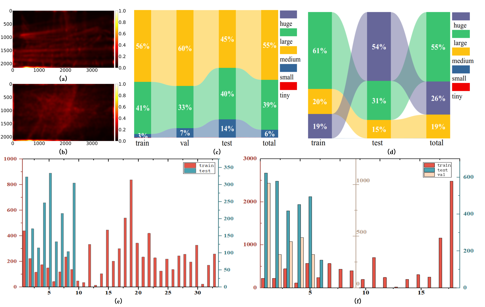

<div align="center">
  <h1>✨ BeltCrack ✨</h1>
</div>


<p align="center">
<h3>
    To propel machine learning advancement in this field, we construct a pair of belt crack detection datasets sequential-image belt crack detection datasets (BeltCrack14ks and BeltCrack9kd), from real-word production factory . 
</h3>

</p>


<p align="center">
    
</p>


<div align="center">
<h3>[Patter Recognization] BeltCrack: the First Sequential-image Industrial Conveyor Belt Crack Detection Dataset and Its Baseline with Triple-domain Feature Learning
</h3>
</div>

<div align="center">
<h4>⭐⭐ If this work is useful to you, please give this repository a star ! ⭐⭐</h4>
</div> 


## 📣 News

- **2025-06-23**: The official Pytorch implementation for **BeltCrackDet** is publicly available in this repository 📦!
- **2025-06-23**: Our industrial belt crack datasets are released for public 🎁!
- **2025-06-21**: We have released our technical report to ArXiv 📤.

## 📜 Datasets Overview

### Download

- You can get the **BeltCrack14ks** from Quark Disk in this [link](https://pan.quark.cn/s/8d6d8d467d9c) with password: **fUTU**
- You can get the **BeltCrack9kd** from Quark Disk in this [link](https://pan.quark.cn/s/1301b216c9e7) with password: **E1St**

### Caption

- The dataset BeltCrack14ks contains 14,087 images, across 29 sequences. While BeltCrack9kd
comprises 9,645 images, from 42 sequences. 
- They are captured in real-world industrial environments, including conveyor
the belt cracks under multiple perspectives (top-down, bottom-up), varying the lighting
conditions from morning strong light to evening low illumination, extreme weather
(sunny, rainy, snowy), and dynamic belt moving speeds.

## 🔑Method

<p align="center">
    
</p>
We propose a tri-path network architecture to implement cross-domain representation learning through Hierarchical Spatial-aware Module (HSM), Aggregative Temporal Module (ATM), and Wavelet-enhanced Frequency-aware Module (WFM). In addition, Residual Compensation Unit (RCU) dynamically mitigates inter-domain representational gaps, while optimizing cross-domain feature fusion.


##  🎫Getting started

### Enviroment

You can create your own conda environment for BeltCrackDet based on the following commands:

```shell
conda create -n BeltCrackDet python=3.9 
conda activate BeltCrackDet
pip install torch==2.0.1 torchvision==0.15.2 torchaudio==2.0.2 --index-url https://download.pytorch.org/whl/cu118
pip install opencv-python==4.11.0.86
pip install einops scikit-learn numpy
```

### Train
You could modify the parameters or paths in the train_BeltCrackDet.py file and run it with the following command (for two GPUs):
```shell
CUDA_VISIBLE_DEVICES=0,1 python train_BeltCrackDet.py 
```

### Test
Once training is complete, you could choose best model <span style="color:red">(usually not 'best_epoch_weights.pth') </span> from "results/beltcrack" to test the performance, and use the following command (for two GPUs):

```shell
CUDA_VISIBLE_DEVICES=0,1 python vid_map_coco.py
```

### Visulization
You could choose the mode "predict" in the "predict.py" file to get the results:

```shell
python predict.py
```

The visualization results of our comparative experiments are as follows:
<p align="center">
    
</p>
<p align="center">
    
</p>

## 🗓️ TODO

- [🟢 Complete] **arXiv preprint release** 
- [🟢 Complete] **Open datasets to public** 
- [🟢 Complete] **Open source code at this repository**
- [🟢 Complete] **Add a description of our datastes and baseline in readme**
- [🟢 Complete] **Add visualization of experiment results in readme**
- [🟡 In Progress] **Submit original manuscripts to Pattern Recognition**


## 📧 Concat
If you have some questions about this work, you can open an issue or contact me via email (with the subject of BeltCrack): jianghong@std.uestc.edu.cn
