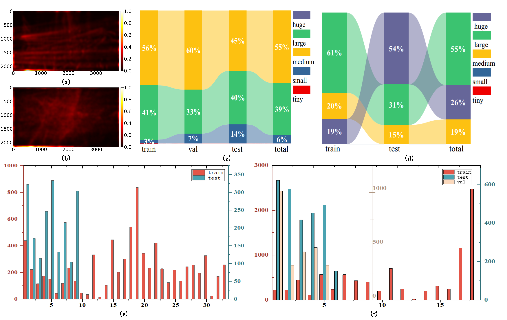

<div align="center">
<h2>BeltCrack: the First Sequential-image Industrial Conveyor Belt Crack Detection Dataset and Its Baseline with Triple-domain Feature Learning
</h2>
</div>


<p align="center">
    
</p>


<p align="center">
  <a href="#news">News</a> •
  <a href="#overview">Datasets Overview</a> •
  <a href="#method">Method</a> •
  <a href="#start">start</a> •
  <a href="#email">Email</a>
</p>


<p align="center">
  <a href="#"></a>
  <a href="#"></a>
  <a href="#"></a>
  <a href="https://github.com/UESTC-nnLab/BeltCrack"></a>
  <a href="https://www.apache.org/licenses/LICENSE-2.0"></a>
</p>


## 📢 News <a name="news"></a>

- **2025-06-22**: The paper is now available on arXiv: http://arxiv.org/abs/2506.17892 📰
- **2025-06-23**: BeltCrackDet PyTorch code and datasets are released 🎁!
- **2026-03-21**: Accepted by  🥂🥂🥂

## 📊 Datasets Overview <a name="overview"></a>

### Download

BeltCrack14ks and BeltCrack9kd will be available for download in this week.

### Caption

- The dataset BeltCrack14ks contains 14,087 images, across 29 sequences. While BeltCrack9kd
comprises 9,645 images, from 42 sequences. 
- They are captured in real-world industrial environments, including conveyor
the belt cracks under multiple perspectives (top-down, bottom-up), varying the lighting
conditions from morning strong light to evening low illumination, extreme weather
(sunny, rainy, snowy), and dynamic belt moving speeds.

## 🔑 Method <a name="method"></a>

<p align="center">
    
</p>
We propose a tri-path network architecture to implement cross-domain representation learning through Hierarchical Spatial-aware Module (HSM), Aggregative Temporal Module (ATM), and Wavelet-enhanced Frequency-aware Module (WFM). In addition, Residual Compensation Unit (RCU) dynamically mitigates inter-domain representational gaps, while optimizing cross-domain feature fusion.


## 🔱 Start   <a name="start"></a>

### Enviroment

You can create your own conda environment for BeltCrackDet based on the following commands:

```shell
conda create -n BeltCrackDet python=3.9 
conda activate BeltCrackDet
pip install torch==2.0.1 torchvision==0.15.2 torchaudio==2.0.2 --index-url https://download.pytorch.org/whl/cu118
pip install opencv-python==4.11.0.86
pip install einops scikit-learn numpy
```

### Train
You could modify the parameters or paths in the train_BeltCrackDet.py file and run it with the following command (for two GPUs):
```shell
CUDA_VISIBLE_DEVICES=0,1 python train_BeltCrackDet.py 
```

### Test
Once training is complete, you could choose best model <span style="color:red">(usually not 'best_epoch_weights.pth') </span> from "results/beltcrack" to test the performance, and use the following command (for two GPUs):

```shell
CUDA_VISIBLE_DEVICES=0,1 python vid_map_coco.py
```

### Visulization
You could choose the mode "predict" in the "predict.py" file to get the results:

```shell
python predict.py
```

The visualization results of our comparative experiments are as follows:
<p align="center">
    
</p>
<p align="center">
    
</p>

## 🗓️ TODO

- [🟢 Complete] **Release arXiv paper** 
- [🟢 Complete] **Release datasets and source code** 
- [🟢 Complete] **Under review at *Pattern Recognition* (1st-round reviews completed)**

## 📧 Email <a name="email"></a>
If you have any questions, contact me via email (**with the subject of BeltCrack**): jianghong@std.uestc.edu.cn

## 🏷️License

This project is released under the [**Apache 2.0**](https://www.apache.org/licenses/) license.


